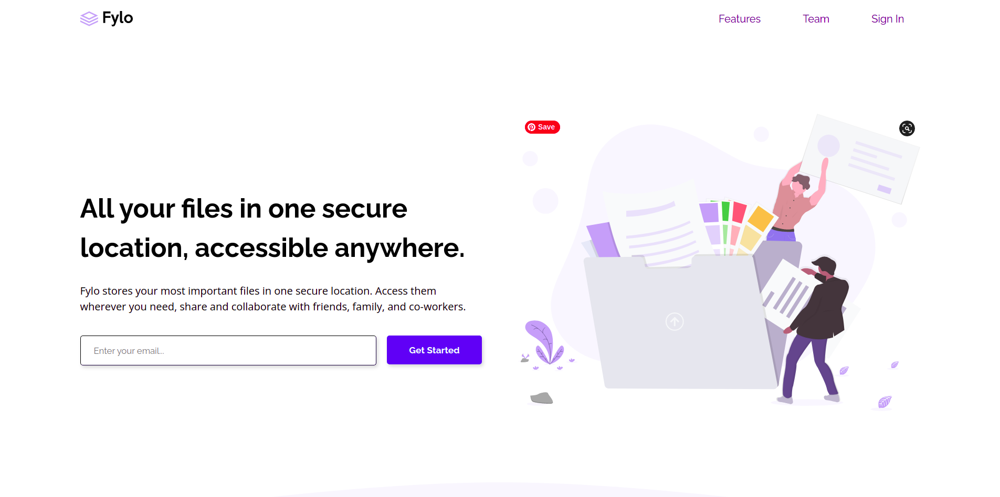

# Frontend Mentor - Fylo landing page with two column layout

## Welcome! 👋

Thanks for checking out this front-end coding challenge.

[Frontend Mentor](https://www.frontendmentor.io) challenges allow you to improve your skills in a real-life workflow.

## Overview

## The challenge

Your challenge is to build out this landing page and get it looking as close to the design as possible.

You can use any tools you like to help you complete the challenge. So if you've got something you'd like to practice, feel free to give it a go.

Your users should be able to:

- View the optimal layout for the site depending on their device's screen size
- See hover states for all interactive elements on the page

### Links

- Solution URL: [repo](https://github.com/AlecANL/fylo-v2-lp)
- Live Site URL: [live demo](https://alecanl.github.io/fylo-v2-lp/)

## My process

### Built with

- Semantic HTML5 markup
- CSS custom properties
- Flexbox
- CSS Grid
- Mobile-first workflow

## Author

- Website - [alec's portfolio](https://www.your-site.com)
- Frontend Mentor - [@ALecANL](https://www.frontendmentor.io/profile/alecanl)
- Twitter - [@alexei_alvarez4](https://www.twitter.com/alexei_alvarez4)
